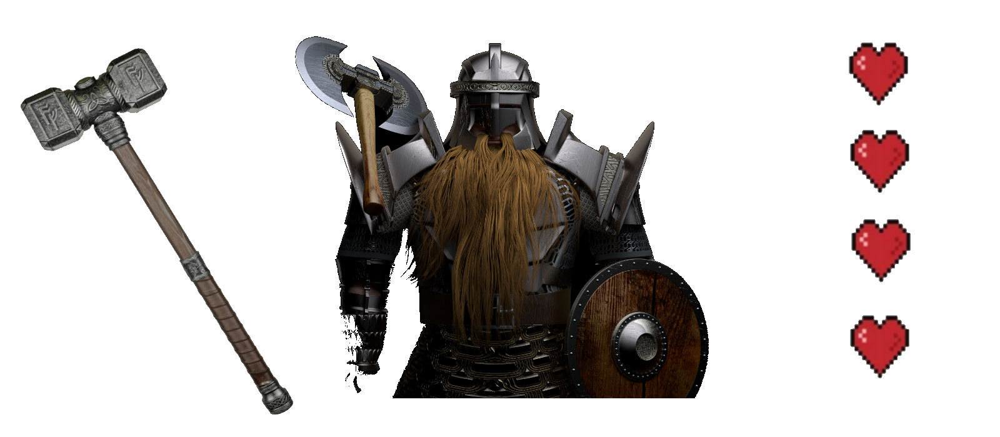
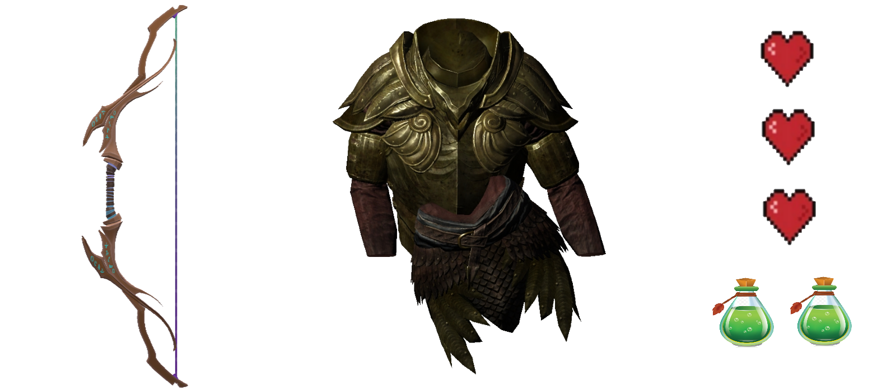

<center> <h1>
    Nain VS Elfe
    </h1> </center>


## Classe Nain: 


* Paramètre ->   nom :int  *nom du Nain*

* Equilibrage : 

    * 

    * | Attaque | Défense | Vie  |
        | :-----: | :-----: | :--: |
        |    5    |    3    |  4   |

* *Méthode* <span style="color:green">**cri()**</span> -> renvoie le cri du nain:  **POUR XAR'SAROTH!!!!**

    
## Classe Elfe:


* Paramètre ->   nom :int  *nom de l'Elfe*

* Equilibrage : 

    * 

    * | Attaque | Défense | Vie  |
        | :-----: | :-----: | :--: |
        |    4   |    3   |  5 |

* *Méthode* <span style="color:green">**cri()**</span> -> renvoie le cri du nain:  **DANS GOMBO Y'A GOMBO Y'A AUBERGINE Y'A TOMATE Y'A AIL ET Y'A OIGNON**

## Fonctions :

* <span style="color:green">**attaque()**</span> :

    * ````python
        def attaque(perso):
            pts = random.randint(1, perso.att)
            return pts
        ````

        **Paramètre** :

       - <span style="color:orange">perso</span> de type **<class '__main__.nain'>** ou **<class '__main__.elf'>**
       
    * Choisit un nombre aléatoire entre 1 et Le nombres de points d'attaque du perso

* <span style="color:green">**defense()**</span> :
  
  * ````python
    def defense(perso):
        pts = random.randint(1, perso.deff)
    	return pts
    ````
    **Paramètre** : 
    
       - <span style="color:orange">perso</span> de type **<class '__main__.nain'>** ou **<class '__main__.elf'>**
    
  * Choisit un nombre aléatoire entre 1 et *Le nombres de points de vie du perso
  
* <span style="color:green">**combat()**</span> :

  * ````python
    def combat(loose, win):
        att = attaque(win)
        armure = defense(loose)
        hp = armure - att
        return [hp, att, armure, win, loose]
    ````
    **Paramètre** :
    
       - <span style="color:orange">win</span> de type *<class '_ _main_ _.nain'>* ou <class '_ _main_ _.elf'>. C'est le perso qui **Attaque**
       - <span style="color:orange"> loose</span> de type *<class '_ _main_ _.nain'>* ou <class '_ _main_ _.elf'>. C'est le perso qui **Défend**
    
  * Calcule la différence entre l'attaque donné par <span style="color:green">**attaque()**</span> et la défense donné par <span style="color:green">**defense()**</span> et renvoie une *list* avec toutes les informations suivante:  ``[defense(loose) - attaque(win), attaque(win), defense(loose), win:perso qui attaque, loose perso qui défend]  `` Ce tableau sera ensuite utiliser dans la fonction <span style="color:green">**result()**</span> 

* <span style="color:green">**result()**</span> :

  * ````python
        def result(tab:list):
          clear_screen()
            cbt = f"----------\n COMBAT \n----------\n{tab[3].cri()}\nResultat de l'attaque de {tab[3].nom}: {tab[1]} \nResultat de la defense de {tab[4].nom}: {tab[2]}"
          if tab[0] >= 0:
              return f"{cbt} \npas de dégats"
          elif tab[0] < 0:
              tab[4].deff -= 1
              return f"{cbt} \n{tab[4].nom} à perdu 1 point de vie"````
    ````
    **Paramètre** :
  
       - <span style="color:orange">tab</span> de type *list* -> c'est le tableau renvoyer par la fonction <span style="color:green">**combat()**</span>
  
  * Cette fonction a pour objectif interpréter le résultat de la fonction <span style="color:green">**combat()**</span> et de renvoyer la conséquence.
      *Par exemple: Si dans <span style="color:green">**combat()**</span> le résultat de <span style="color:green">**attaque()**</span> est supérieur à celui de <span style="color:green">**defense()**</span> le personnage qui attaque perd 1 point*
      Donc cette fonction permet interpréter et de renvoyer les in formation a travers une chaine de caractère: *string* pour que le tout soit facilement compréhensible et claire en console
  
  * <span style="color:green">**game()**</span> :
  
      * ````python
          def game():
              """succéssion de combat tant qu'il reste de la vie aux personnages"""
              clear_screen()
              print("---------------------------------\n BIENVENUE DANS ELFE VERSUS NAIN \n---------------------------------")
              perso_nain = nain(str(input("Nom du Nain :")))
              perso_elfe = elf(str(input("Nom de l'Elfe :")))
              clear_screen()
              print(f"Le nom du nain est: {perso_nain.nom}\nLe nom de l'elf est: {perso_elfe.nom}")
              while perso_nain.deff > 0 and perso_elfe.deff > 0:
                  choix = input("choisissez qui attaque (n)ain ou (e)lf : ")
                  if choix == "n":
                      print(result(combat(perso_elfe, perso_nain)))
                  elif choix == "e":
                      print(result(combat(perso_nain, perso_elfe)))
                  else:
                      choix = input("choisissez qui attaque en premier (n)ain ou (e)lf : ")
              if perso_nain.deff <= 0:
                  clear_screen()
                  print(f"'3[1m' + Fin du combat c'est {perso_elfe.nom} qui a gagné")
              elif perso_elfe.deff <= 0:
                  clear_screen
                  print(f"'3[1m' + Fin du combat c'est {perso_nain.nom} qui a gagné")
              encore = input("Voulez vous faire une autre partie o = oui / n = non: ")
              if encore == "o":
                  game()
              else:
                  os.system('exit()')
          ````
  
      * Cette fonction est le cœur du jeu. Elle permet a l'utilisateur de choisir le nom du Nain (ligne 5) et de l'Elfe (ligne 6). Ensuite `while`permet de répéter les combat jusqu'à ce qu'un personnage n'ait plus de points de vie grâce a la condition `perso_nain.deff > 0 and perso_elfe.deff > 0`. Ensuite `input("choisissez qui attaque (n)ain ou (e)lf : ")` permet a l'utilisateur de choisir quel personnage attaque. Le combat se déroule de cette manière : `result(combat(perso qui défend, perso qui attaque)) ` . Enfin quand le combat est terminé la fonction renvoie le nom de gagnant (ligne 17 à 22). Enfin on demande avec la variable `encore`(ligne 23) si l'utilisateur veut refaire une partie si oui on réexécute <span style="color:green">**game()**</span> dans le cas contraire on quitte le programme.
  
      
  
      ## Démarrage :
      
      * Pour lancer le programme il vous suffit ouvrir une console de vous placer dans le fichier source et d'executer `` py .\index.py`` 
      * Et voila vous etes fin prêt à commmencer le combat soldat.
      
      
      
      
      
      

